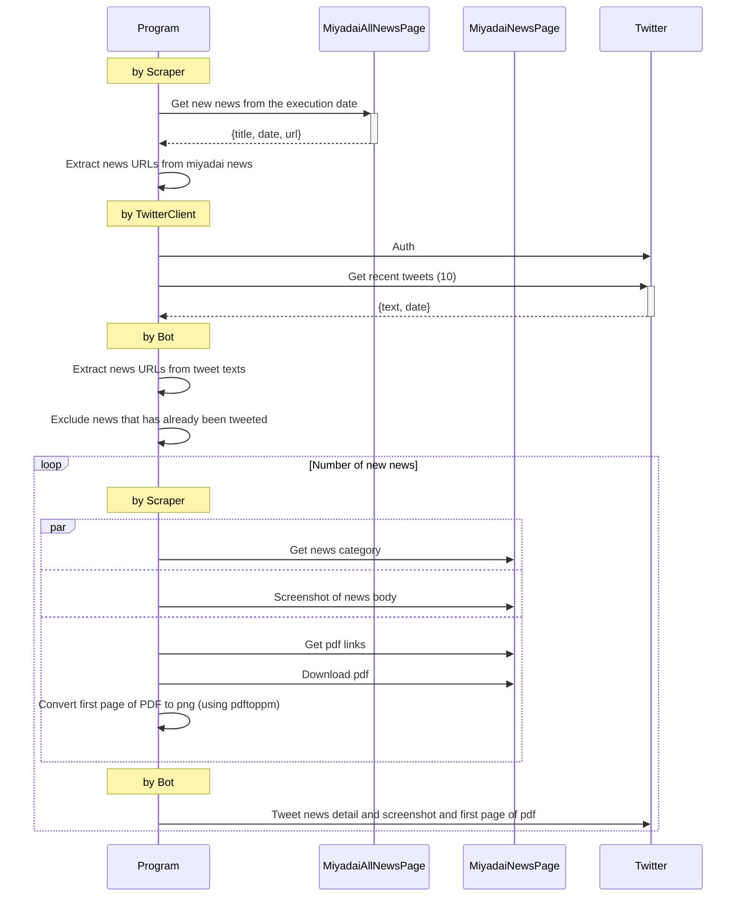

# miyadai-oshirase-twitter-bot

[](https://github.com/korosuke613/miyadai-oshirase-twitter-bot/actions/workflows/ci.yaml) [](https://codecov.io/gh/korosuke613/miyadai-oshirase-twitter-bot)

## Flow
Steps to tweet.



<!--
https://mermaid.js.org/syntax/sequenceDiagram.html#sequencenumbers
-->

<details>
<summary>Twitter API elevete log</summary>

申請文

```
私の所属していた大学のお知らせを自動でツイートするbotを運用します。大学のサイトをスクレイピングし、まだツイートされていなければツイートするようにします。そのために、`GET /2/users/:id/tweets`を運用するアカウントに使い、最大10の直近のツイートを取得します。取得したツイートを解析し、新しいツイートが重複していないかを確認します。
```

英語

```
I will run a bot that automatically tweets announcements from my university. It will scrape the university's website and tweet if it hasn't been tweeted yet. To do this, I will use `GET /2/users/:id/tweets` for the account I operate and retrieve up to 10 most recent tweets. The retrieved tweets are parsed to check for duplicate new tweets.
```

```
`GET /2/users/:id/tweets`を運用するアカウントに使い、最大10の直近のツイートを取得します。取得したツイートを解析し、新しいツイートが重複していないかを確認します。
他のアカウントのツイートを取得する予定はありません。
```

```
Use `GET /2/users/:id/tweets` for accounts that operate and retrieve up to 10 most recent tweets. The retrieved tweets are parsed to check for duplicate new tweets.
I do not plan to retrieve tweets from other accounts.
```

```
`Tweet`を利用します。お知らせをTweetする必要があるからです。もちろん、それ以外の権限（Retweet, Like, Follow, or Direct Message）は利用しません。
```

```
Use `Tweet`. This is because I need to Tweet the announcement. Of course, other permissions (Retweet, Like, Follow, or Direct Message) are not used.
```

</details>


